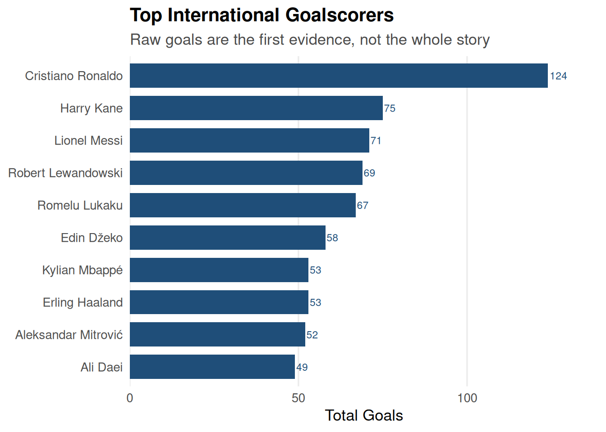
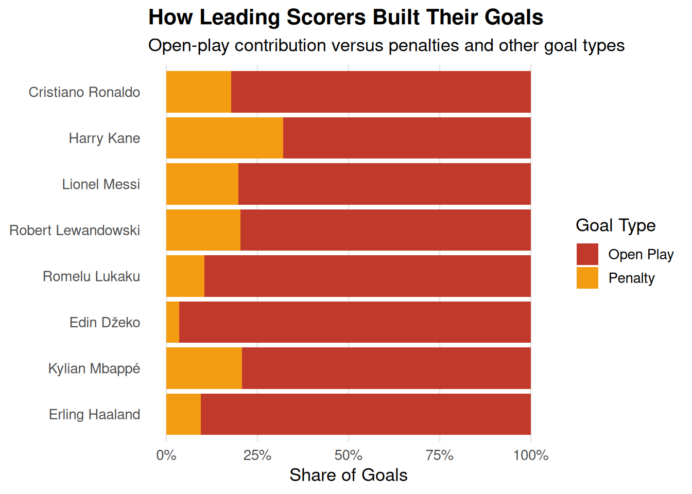

::: {.cell}

:::

# Main Question

Who is the greatest international striker of all time?

This report uses three simple measures of greatness: scoring volume, longevity, and scoring style. Together, they build a clear and balanced case.

## 1. Scoring volume

The strongest starting point is total goals. A player who dominates this measure has the clearest initial case.

::: {.cell}
::: {.cell-output-display}
{width=672}
:::
:::

- The leading player stands out clearly.
- This is the strongest first indicator of greatness because it measures direct output.

## 2. Longevity and consistency

Greatness is not only about a short peak. A long scoring career suggests durability and sustained quality.

::: {.cell}
::: {.cell-output-display}
{width=672}
:::
:::

- The strongest candidates also score over many seasons.
- Longevity strengthens the case because it shows sustained elite performance.

## 3. Scoring style

Open-play goals often reflect broader attacking quality than a penalty-heavy profile.

::: {.cell}
::: {.cell-output-display}
{width=672}
:::
:::

- The leading scorers are mostly built on open-play production.
- That makes the case for true striker quality stronger.

## Final takeaway

The best overall answer is the player who combines:

- the highest scoring total,
- the longest sustained career,
- and the strongest open-play profile.

That combination offers the clearest evidence for being the greatest international striker of all time.

## About the Author

::: {.callout-note}
**Name:** [Placeholder]  
**School:** [Placeholder]  
**Grade:** [Placeholder]

**Why I chose this project:** I chose this project because it allowed me to explore a familiar sports question through data and visualization.

**What I learned:**
- How to clean and analyze a real dataset in R
- How to create clear charts that support a claim
- How to present findings in a concise Quarto report
:::

## References

Goalscorers dataset. (n.d.). Unpublished dataset used for this project.

R Core Team. (2024). R: A language and environment for statistical computing. R Foundation for Statistical Computing. https://www.R-project.org/

Wickham, H., et al. (2019). tidyverse: Easily install and load the tidyverse. https://CRAN.R-project.org/package=tidyverse

Wickham, H. (2016). ggplot2: Elegant graphics for data analysis. Springer-Verlag New York. https://ggplot2.tidyverse.org/

Allaire, J. J., et al. (2024). Quarto. https://quarto.org/

Wickham, H., et al. (2023). dplyr: A grammar of data manipulation. https://CRAN.R-project.org/package=dplyr

Wickham, H., et al. (2023). readr: Read rectangular text data. https://CRAN.R-project.org/package=readr

Wickham, H. (2023). forcats: Tools for working with categorical variables. https://CRAN.R-project.org/package=forcats

